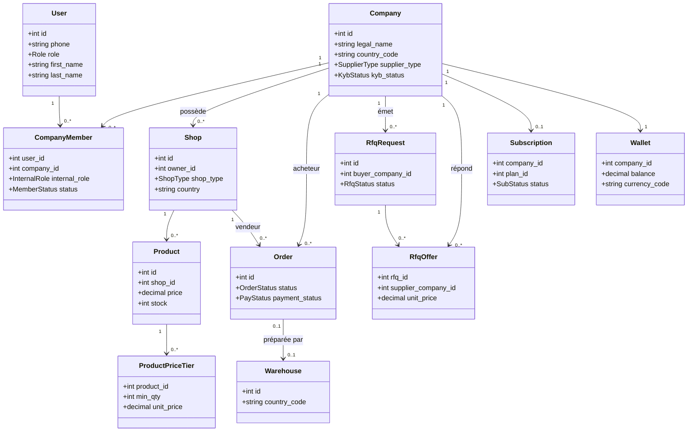
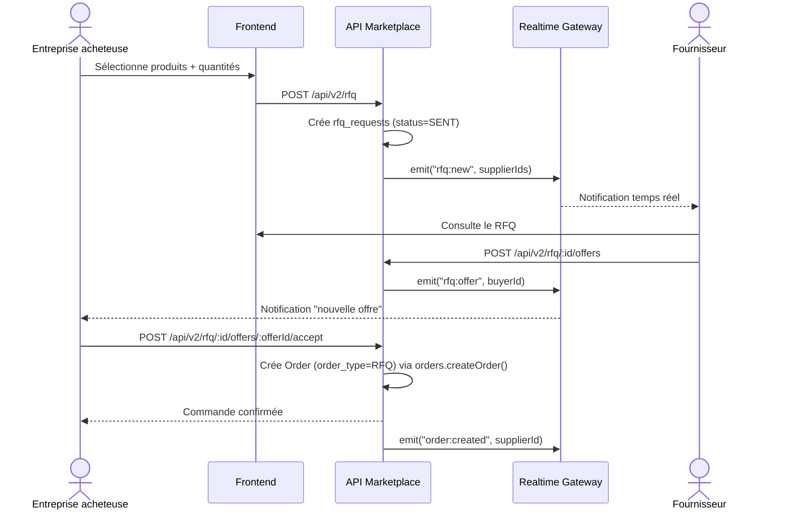
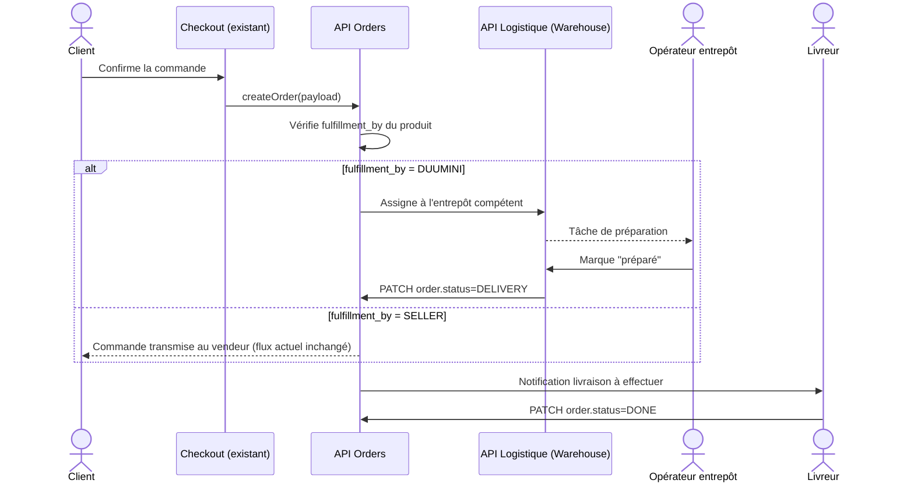
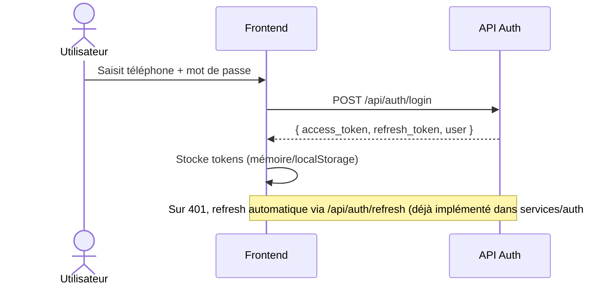
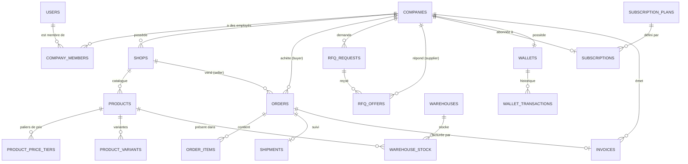
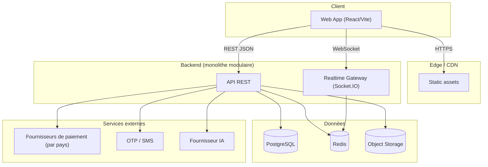
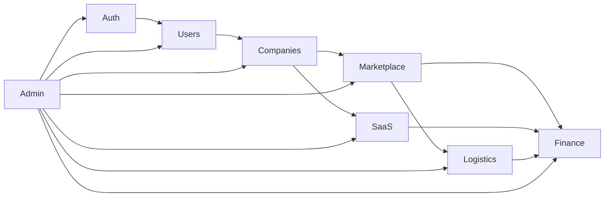
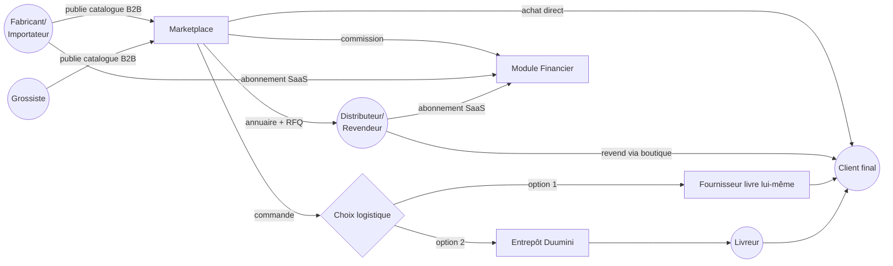
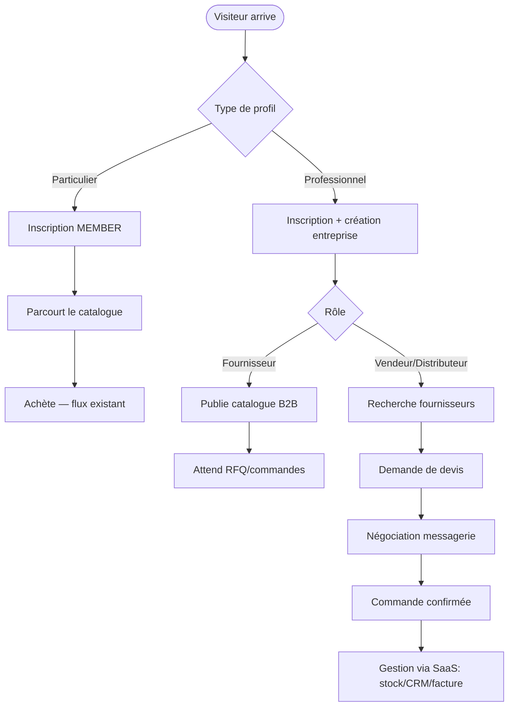

# 23–27. Diagrammes

Tous les diagrammes sont en syntaxe [Mermaid](https://mermaid.js.org/) — rendus nativement par GitHub, GitLab, Notion, et la plupart des éditeurs (VS Code avec l'extension Mermaid).

## 23. Diagramme UML (classes / domaines principaux)

## 24. Diagrammes de séquence

### Séquence — Demande de devis (RFQ) jusqu'à la commande

### Séquence — Commande avec logistique confiée à Duumini

### Séquence — Authentification (existant, à conserver tel quel)

## 25. Diagramme de base de données (ER simplifié)

## 26. Diagrammes d'architecture

### Vue déploiement (cible, sans microservices day-1)

### Vue modules internes du backend

## 27. Diagrammes de flux utilisateurs

### Flux global multi-acteurs

### Parcours détaillé — voir aussi [02-modules-fonctionnels.md §7](./02-modules-fonctionnels.md)

